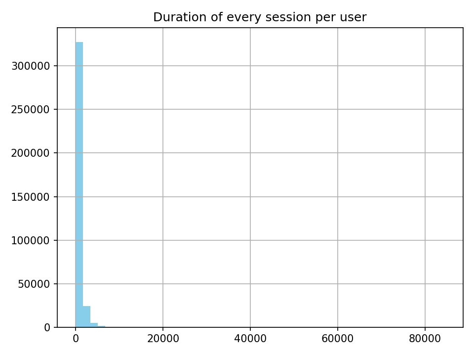
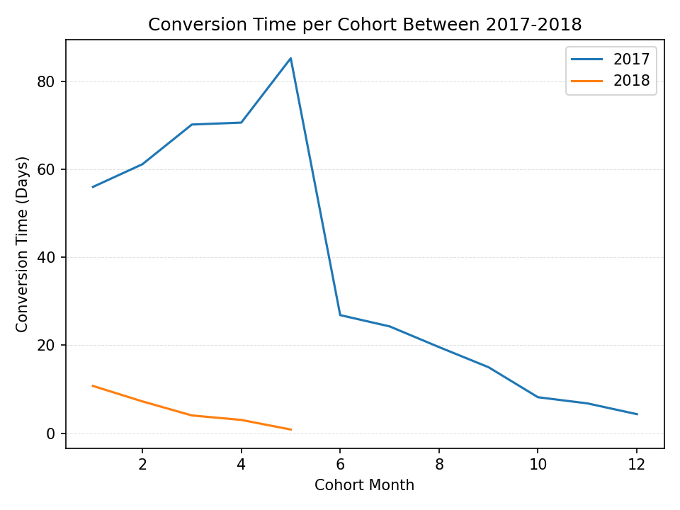
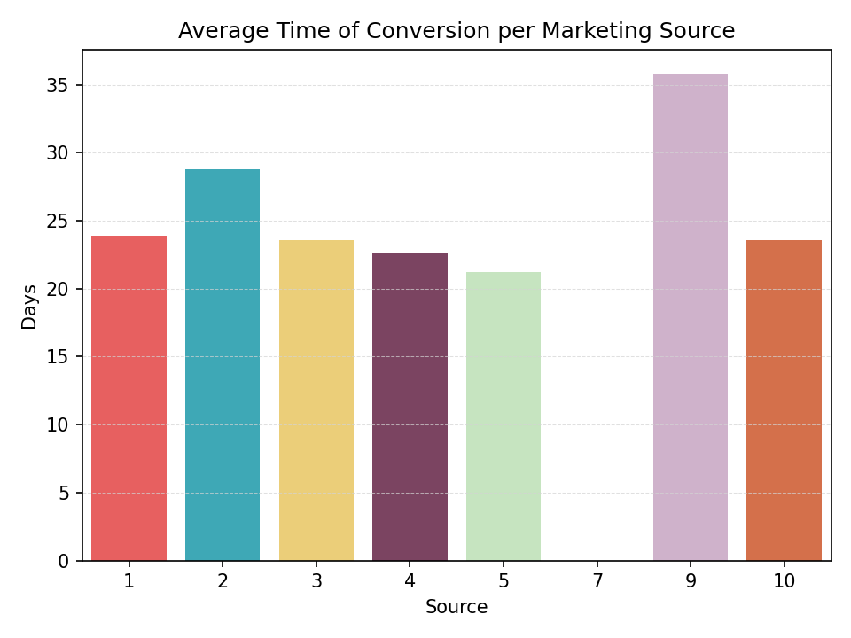
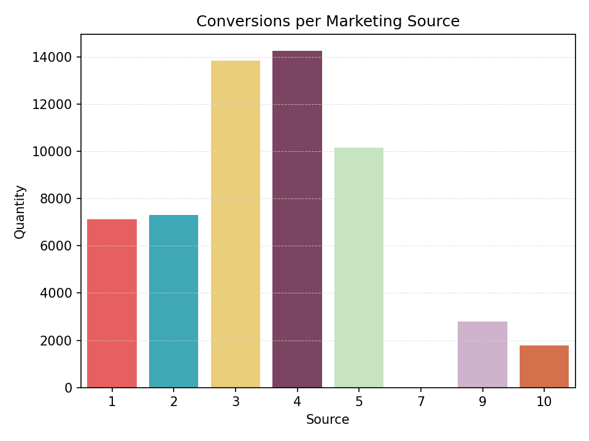
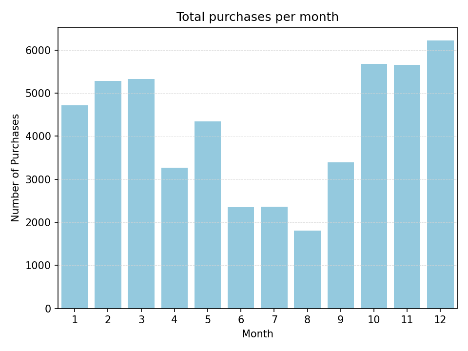
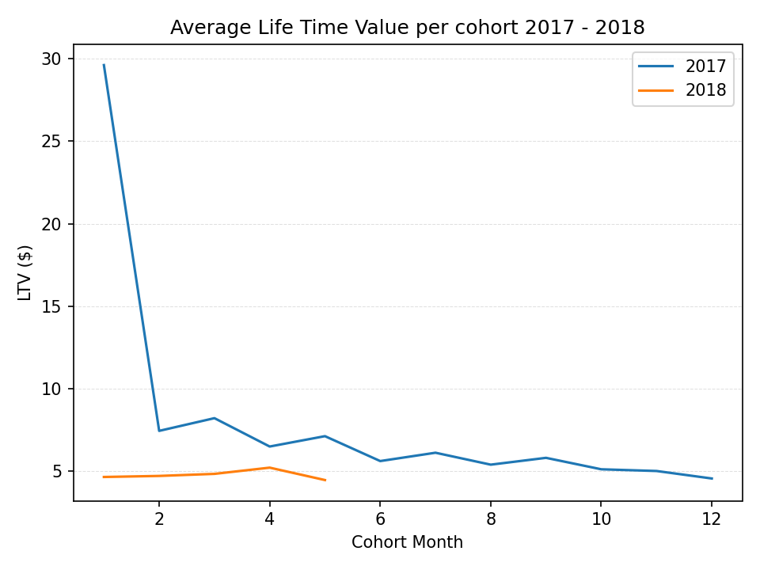
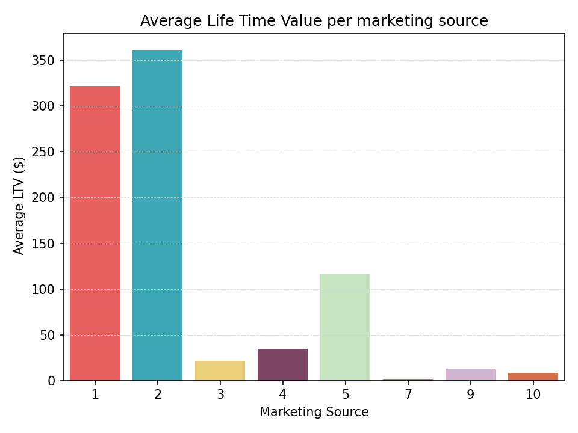
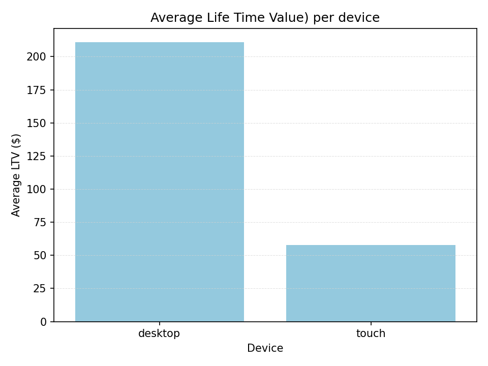
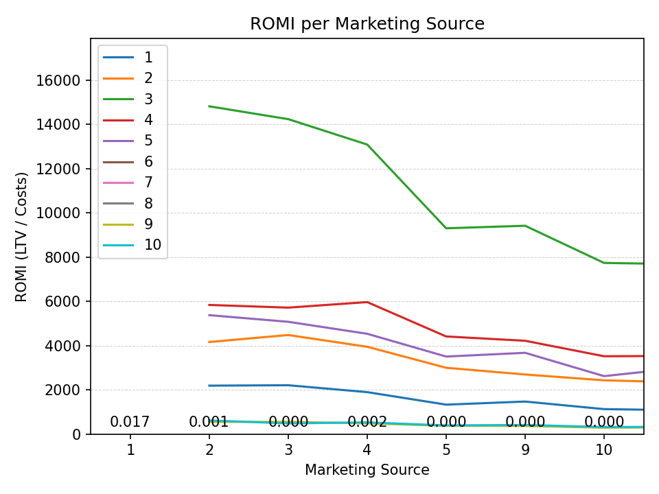

# Marketing Performance Analysis
This project analyzes the performance o multiple marketing sources through business metrics -**CAC(Customer Acquisition Cost), LTV(Lifetime Value), and ROMMI (Return on Marketing Investment)** - using data from user sessions, orders and marketing costs for an online store that sells events tickets. 
The goal is to identify which acquisition sources are the most efficient and profitable, supporting data-driven marketing decisions. 

## Objectives
- Analyze user behaviour across sessions, cohorts and purchase frequency
- Measure conversion times and indentify the fastest-performing marketing channels.
- Calculate CAC, LTV and ROMI by channel.
- Provide insights and recommendations for oprimizing marketing investment.

## Techonologies Used
- Python
- Pandas
- Seaborn
- Matplotlib
- Datasets: (visits_log_us.csv, orders_log_us.csv, costs_us.csv)

## Key Metrics
**CAC**: Average cost required to accquire one customer per marketing source.
**LTV**: Average revenue generated by a user during their lifetime.
**ROMI**: Ratio of revenue generated to marketing spend (LTV / Cost).
**Conversion Time**: Average number of time (days) users take to becomme customers.

## Key Visualizations

### Session Duration per User

### Conversion Time per Cohort

### Average Time of Conversion per Marketing Source 

### Conversion Time by Marketing Channel

### Purchases per Month

### Life Time Value per Cohort 

### Life Time Value per Marketing Channel

### Life Time Value per Device

### Return of Marketing Investment

